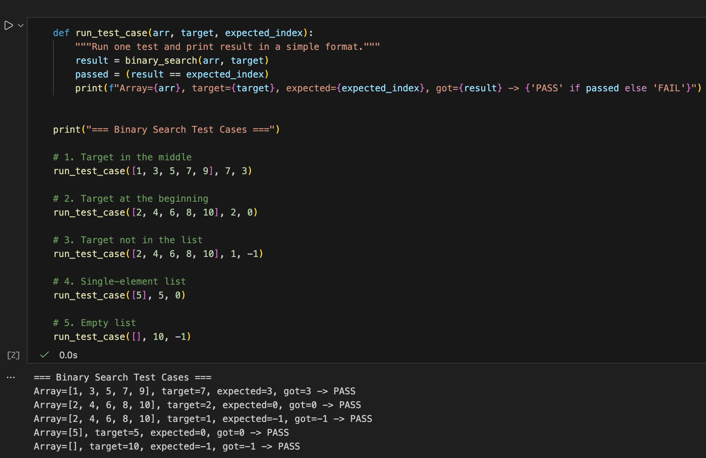

# Binary Search Visualizer

## Demo

## Problem Breakdown & Computational Thinking

**Problem**

Given a **sorted list** of numbers and a **target** value, decide:
- Is the target in the list?
- If yes, at which index?
- If not, return `-1`.

**Decomposition**

I break the problem into smaller steps:

1. Keep track of two positions:
   - `low` → start of the current search range.
   - `high` → end of the current search range.
2. While there is still a range to search (`low <= high`):
   - Find the middle index: `mid = (low + high) // 2`.
   - Look at the value at that middle index.
   - If the middle value equals the target → return `mid`.
   - If the middle value is greater than the target → move the search to the left half by setting `high = mid - 1`.
   - If the middle value is less than the target → move the search to the right half by setting `low = mid + 1`.
3. If `low` goes past `high`, it means the target is not in the list → return `-1`.

**Pattern Recognition**

- Each step cuts the search range roughly in half.
- The pattern is:
  - Look at the middle,
  - Decide left or right,
  - Repeat on a smaller range.

**Abstraction**

For the user:

- They only see:
  - A list of numbers.
  - A target value.
  - The final result: index or “not found”.
  - The input will be sorted for the user, if not inputed sorted
  - An error message will pop up if the user misinputs
  

The user does not have to think about:

- How `low`, `mid`, and `high` move.
- How many steps it takes.
- The index calculations.

**Algorithm in Plain Language**

1. Start with a sorted list and a target.
2. Set `low` to the first index (0) and `high` to the last index (`len(list) - 1`).
3. While `low` is less than or equal to `high`:
   - Set `mid = (low + high) // 2`.
   - If the middle value equals the target, return `mid`.
   - If the middle value is bigger than the target, move `high` left to `mid - 1`.
   - If the middle value is smaller than the target, move `low` right to `mid + 1`.
4. If the loop finishes without finding the target, return `-1` to show it is not in the list.

## Steps to Run

5. In the web interface:
   - Enter a list of integers, e.g. `1, 3, 5, 7, 9`.
   - Enter a target value, e.g. `7`.
   - Click the button to see the result and the step-by-step search log.

## Testing Screenshot

Below is an example of the tests passing in the notebook / app:

## Hugging Face Link

Live demo (if deployed):

- [Binary Search Visualizer – Hugging Face Space](PASTE_LINK_HERE)

## Author & Acknowledgment

- **Author:** Ahmed Ghassel (with AI assitence up to level 4)
- **Course:** CISC 121 – Algorithm Project  
- Thanks to the course materials and Gradio documentation for help with structuring the project and UI.
